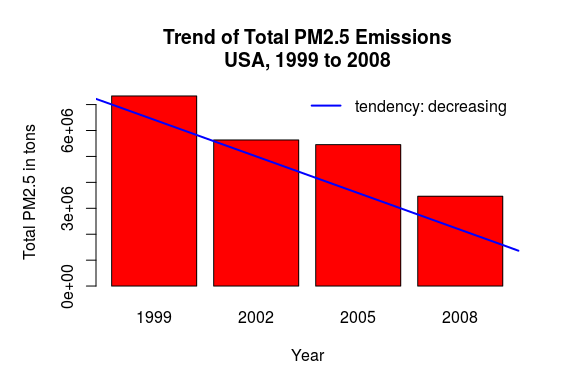
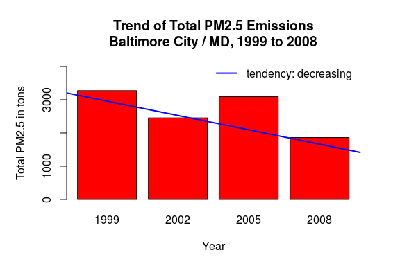
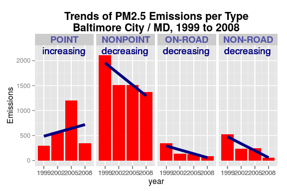
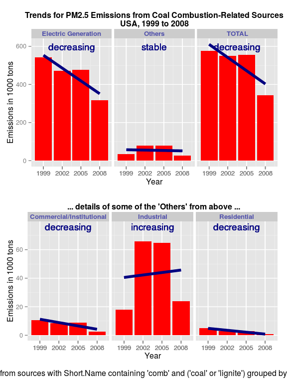
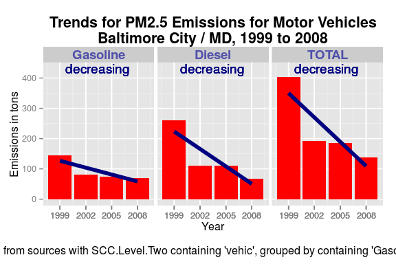

# ExData Course Project 2
Ronald Stalder  
`r Sys.Date()`  

## get and read the data

The data for this assignment are available from the course web site as a single zip file:

- [Data for Peer Assessment](https://d396qusza40orc.cloudfront.net/exdata%2Fdata%2FNEI_data.zip) [29Mb]  

The zip file contains two files:

PM2.5 Emissions Data (`summarySCC_PM25.rds`): This file contains a data frame with all of the PM2.5 emissions data for 1999, 2002, 2005, and 2008. For each year, the table contains number of tons of PM2.5 emitted from a specific type of source for the entire year. Here are the first few rows.

```
##     fips      SCC Pollutant Emissions  type year
## 4  09001 10100401  PM25-PRI    15.714 POINT 1999
## 8  09001 10100404  PM25-PRI   234.178 POINT 1999
## 12 09001 10100501  PM25-PRI     0.128 POINT 1999
## 16 09001 10200401  PM25-PRI     2.036 POINT 1999
## 20 09001 10200504  PM25-PRI     0.388 POINT 1999
## 24 09001 10200602  PM25-PRI     1.490 POINT 1999
```

- `fips`: A five-digit number (represented as a string) indicating the U.S. county

- `SCC`: The name of the source as indicated by a digit string (see source code classification table)

- `Pollutant`: A string indicating the pollutant

- `Emissions`: Amount of PM2.5 emitted, in tons

- `type`: The type of source (point, non-point, on-road, or non-road)

- `year`: The year of emissions recorded


Source Classification Code Table (`Source_Classification_Code.rds`): This table provides a mapping 
from the SCC digit strings in the Emissions table to the actual name of the PM2.5 source. 
The sources are categorized in a few different ways from more general to more specific and you 
may choose to explore whatever categories you think are most useful. For example, source “10100101” is known as “Ext Comb /Electric Gen /Anthracite Coal /Pulverized Coal”.


```r
zipFile <- "NEI_data.zip"
url <- "https://d396qusza40orc.cloudfront.net/exdata%2Fdata%2FNEI_data.zip"

if (!file.exists(zipFile)) {
  download.file(url, zipFile, method="curl", mode="wb")
  unzip(zipFile, setTimes=TRUE)
}

print(paste("the zip file", zipFile, 
            "was downloaded/extracted on:", file.info(zipFile)$mtime))
```

```
## [1] "the zip file NEI_data.zip was downloaded/extracted on: 2015-01-08 08:11:12"
```


```r
library(data.table, warn.conflicts = FALSE, quietly = TRUE, verbose = FALSE)
library(ggplot2, warn.conflicts = FALSE, quietly = TRUE, verbose = FALSE)
library(grid, warn.conflicts = FALSE, quietly = TRUE, verbose = FALSE)

dataFile <- "summarySCC_PM25.rds"
codeFile <- "Source_Classification_Code.rds"

NEI <- as.data.table(readRDS("summarySCC_PM25.rds"))
SCC <- as.data.table(readRDS("Source_Classification_Code.rds"))

# function to determine whether tendency increasing or decreasing
getTrend <- function(years, emiss, eps=0.005) {
    linreg <- lsfit(1:length(years)-1, emiss)
    ang <- linreg$coefficients[2]/(max(emiss)-min(emiss))
    return(ifelse(ang < -1*eps, "decreasing", ifelse(ang > eps, "increasing", "stable")))
}
# table of tendencies for each facet
TrendTable <- function(dt, byCol, margin=FALSE, eps=0.005) {
    evalX <- function(txt) {eval(parse(text=txt))}
    st <- evalX(paste0("dt[ ,sum(Emissions), by=list(year,",byCol,")]"))
    tt <- evalX(paste0("data.table(grp=levels(as.factor(st$",byCol,")))"))
    tt <- evalX(paste0("tt[,trend:=sapply(grp,function(x){t<-st[",
                       byCol,"==x];getTrend(t$year, t$V1, eps=eps)})]"))
    if (margin) {
        rbind(tt, list("(all)",getTrend(st$year, st$V1, eps=eps)))
    }
    return(tt)
}
```

## plot1: Tendency in total US emissions  

1. Have total emissions from PM2.5 decreased in the United States from 1999 to 2008? Using the **base** plotting system, make a plot showing the *total* PM2.5 emission from all sources for each of the years 1999, 2002, 2005, and 2008.


```r
# Have total emissions from PM2.5 decreased in the United States from 1999 to 2008?

# total emissions for all USA by year
SUM <- NEI[ ,sum(Emissions), by=year][ ,`:=`(totEm=V1,V1=NULL)]
trend <- getTrend(SUM$year, SUM$totEm)

par(bg = "white", mar = c(5,5,5,2), oma = c(0,0,0,1))
barplot(SUM$totEm, col = "red", names.arg = SUM$year,
     main = "Trend of Total PM2.5 Emissions\nUSA, 1999 to 2008",
     xlab = "Year", ylab = "Total PM2.5 in tons")
abline(lsfit(1:length(SUM$year)-1, SUM$totEm), lwd = 2, col = "blue")
legend("topright",paste("tendency:", trend), 
       lty = "solid", lwd = 2, col = "blue", bty = "n", inset = c(0.01, -0.05))
```

 

```r
# copy the screen plot to png file
noprint <- dev.copy(png, file = "plot1.png",
                         width = 720, height = 480, units = "px")
noprint <- dev.off() ## Don't forget to close the PNG device!
```

## plot2: Tendency for total emissions in Baltimore/MD  

2. Have total emissions from PM2.5 decreased in the **Baltimore City, Maryland** (`fips == "24510"`) from 1999 to 2008? Use the **base** plotting system to make a plot answering this question.


```r
# Have total emissions from PM2.5 decreased in the **Baltimore City, Maryland** 
# (`fips == "24510"`) from 1999 to 2008?

# total emissions for Baltimore by year
SUM <- NEI[fips == "24510", ][, sum(Emissions), by=year][ ,`:=`(totEm=V1,V1=NULL)]
trend <- getTrend(SUM$year, SUM$totEm)

par(bg = "white", mar = c(5,5,5,2), oma = c(0,0,0,1))
barplot(SUM$totEm, col = "red", names.arg = SUM$year, ylim = c(0, 4000),
     main = "Trend of Total PM2.5 Emissions\nBaltimore City / MD, 1999 to 2008",
     xlab = "Year", ylab = "Total PM2.5 in tons")
abline(lsfit(1:length(SUM$year)-1, SUM$totEm), lwd = 2, col = "blue")
legend("topright",paste("tendency:", trend), 
       lty = "solid", lwd = 2, col = "blue", bty = "n", inset = c(0.01, -0.05), cex = 1.0)
```

 

```r
# copy the screen plot to png file
noprint <- dev.copy(png, file = "plot2.png",
                         width = 720, height = 480, units = "px")
noprint <- dev.off() ## Don't forget to close the PNG device!
```

## plot3: Tendency for total emissions in Baltimore/MD  

3. Of the four types of sources indicated by the `type` (point, nonpoint, onroad, nonroad) variable, which of these four sources have seen decreases in emissions from 1999–2008 for **Baltimore City**? Which have seen increases in emissions from 1999–2008? Use the **ggplot2** plotting system to make a plot answer this question.


```r
# Of the 4 **type** of sources which increase/decrease
# for **Baltimore City, Maryland** (`fips == "24510"`) from 1999 to 2008?

# Emissions Baltimore by year and type
# set type as factor in desired order (default is alphabetical)
BALT <- NEI[fips == "24510", ][ ,sum(Emissions), by=list(year,type)
          ][ ,`:=`(type=factor(type, levels=c("POINT","NONPOINT","ON-ROAD","NON-ROAD"))
                   ,Emissions=V1,V1=NULL)]

# get tendency for each type
tt <- TrendTable(BALT,"type")
setkey(BALT,type); setkey(tt,grp)
BALT <- BALT[tt][, `:=`(x=2003.4, y=2200)]

BALT

gp3 <- ggplot(BALT, aes(year,Emissions)) +
       facet_grid(. ~ type) +
       geom_bar(stat="identity", fill="red") +
       scale_x_continuous(breaks=BALT$year, labels=BALT$year) +
       geom_smooth(method = "lm", se=FALSE, size=2, colour="navy") +
       geom_text(aes(x, y, label=trend), data=BALT, colour="navy") +
       ggtitle("Trends of PM2.5 Emissions per Type\nBaltimore City / MD, 1999 to 2008") +
       theme(strip.text.x = element_text(size=14, face="bold", colour="#5050AA"),
             plot.title = element_text(lineheight=.9, face="bold", size=16))
print(gp3)
```

 

```r
# copy the screen plot to png file
noprint <- dev.copy(png, file = "plot3.png",
                         width = 720, height = 480, units = "px")
noprint <- dev.off() ## Don't forget to close the PNG device!
```

## plot4: Tendency for coal combustion-related emissions all USA  

4. Across the United States, how have emissions from coal combustion-related sources changed from 1999–2008?


```r
# How have emissions from coal combustion-related sources changed 
# in the USA from 1999 to 2008?

# COAL COMBUSTION-RELATED SOURCES:
# ==> from SCC select sources with "Short.Name" containing "comb" and "coal"
#     (in any sequence and ignoring lower-/uppercase)

SCCsel <- SCC[grep("comb.*coal|coal.*comb", Short.Name, ignore.case=TRUE, value=FALSE), 
                list(SCC,SCC.Level.Two)]
# resume SCC.Level.Two to "Electric Generation" and "Others"
SCCsel <- SCCsel[, `:=`(L2res=ifelse(SCC.Level.Two=="Electric Generation",
                                     "Electric Generation", "Others"))]

# ==> select these SCCs from NEI, merging in columns SCC.Level.Two, L2res (for grouping)
#     (in SQL terms: INNER JOIN)

setkey(NEI,SCC); setkey(SCCsel,SCC)
COAL <- NEI[, list(SCC,year,Emissions)][SCCsel, nomatch=0]

# PLOT a): facetting by resumed level L2res
#          - can't use margins=TRUE on facet_grid; trend labels get confused,
#            so add the total per year
COALa <- COAL[ ,sum(Emissions), by=list(year,L2res)
           ][ ,`:=`(Emissions=V1/1000,V1=NULL)]     # kilo-tons
COALa <- rbind(COALa, COALa[ ,sum(Emissions), by=year,
           ][ ,`:=`(Emissions=V1,V1=NULL,L2res="TOTAL")])     # already kilo-tons

# get tendency for each L2res and (all)
tt <- TrendTable(COALa,"L2res", margin=FALSE, eps=0.1)
setkey(COALa,L2res); setkey(tt,grp)
COALa <- COALa[tt][, `:=`(x=2003.5, y=650)]

gp4a <- ggplot(COALa, aes(year,Emissions)) +
        facet_grid(. ~ L2res, margins=FALSE) +
        geom_bar(stat="identity", fill="red") +
        scale_x_continuous(breaks=COALa$year, labels=COALa$year) +
        scale_y_continuous(name="Emissions in 1000 tons") +
        geom_smooth(method = "lm", se=FALSE, size=2, colour="navy") +
        geom_text(aes(x, y, label=trend), data=COALa, colour="navy") +
        xlab("Year") +
        ggtitle(paste("Trends for PM2.5 Emissions from Coal Combustion-Related Sources",
                      "USA, 1999 to 2008",
                      sep = "\n")) +
        theme(strip.text.x = element_text(size=10, face="bold", colour="#5050AA"),
              plot.title = element_text(lineheight=.9, face="bold", size=12))

# PLOT b): facetting by SCC.Level.Two where L2res == "Others"
#          except "Space Heaters" and "Total Area...."
COALb <- COAL[L2res=="Others" & 
              !SCC.Level.Two %in% c("Space Heaters","Total Area Source Fuel Combustion",
                                    "Electric Utility"), 
            ][, sum(Emissions), by=list(year,SCC.Level.Two)
            ][ ,`:=`(Emissions=V1/1000,V1=NULL,L2=as.character(SCC.Level.Two))]     # kilo-tons

# get tendency for each SCC.Level.Two
tt <- TrendTable(COALb,"L2", margin=FALSE, eps=0.005)
setkey(COALb,L2); setkey(tt,grp)
COALb <- COALb[tt][, `:=`(x=2003.5, y=70)]

gp4b <- ggplot(COALb, aes(year,Emissions)) +
        facet_grid(. ~ SCC.Level.Two, margins=FALSE) +
        geom_bar(stat="identity", fill="red") +
        scale_x_continuous(breaks=COALb$year, labels=COALb$year) +
        scale_y_continuous(name="Emissions in 1000 tons") +
        geom_smooth(method = "lm", se=FALSE, size=2, colour="navy") +
        geom_text(aes(x, y, label=trend), data=COALb, colour="navy") +
        xlab(paste0("Year\n\n",
                    "Emissions from sources with Short.Name containing 'comb' and 'coal'",
                    " grouped by SCC.Level.Two")) +
        ggtitle(" ... details of some of the 'Others' from above ...") +
        theme(strip.text.x = element_text(size=10, face="bold", colour="#5050AA"),
              plot.title = element_text(face="bold", size=12))

# put the two plots on one page
grid.newpage()
pushViewport(viewport(layout = grid.layout(2, 1)))
print(gp4a, vp = viewport(layout.pos.row = 1, layout.pos.col = 1))
print(gp4b, vp = viewport(layout.pos.row = 2, layout.pos.col = 1))
```

 

```r
# copy the screen plot to png file
noprint <- dev.copy(png, file = "plot4.png",
                         width = 720, height = 960, units = "px")
noprint <- dev.off() ## Don't forget to close the PNG device!
```

## plot5: Tendency for motor vehicle emissions in Baltimore/MD  

5. How have emissions from motor vehicle sources changed from 1999–2008 in **Baltimore City**?


```r
# How have emissions from motor vehicle sources changed
# for **Baltimore City, Maryland** (`fips == "24510"`) from 1999 to 2008?

# MOTOR VEHICLE SOURCES:
# ==> from SCC select sources with "SCC.Level.Two" containing "vehic"
#     (ignoring lower-/uppercase)
# ==> make fuel groups "Diesel", "Gasoline" 

SCCsel <- SCC[grep("vehic", SCC.Level.Two, ignore.case=TRUE, value=FALSE), 
                list(SCC, SCC.Level.Two)
            ][, fuel:=as.factor("Gasoline")]
SCCsel <- SCCsel[grep("Diesel", SCC.Level.Two), fuel:="Diesel"]

# ==> select these SCCs from NEI for Baltimore, merging in column Fuel
#     (in SQL terms: INNER JOIN)

setkey(NEI,SCC); setkey(SCCsel,SCC)
BALT <- NEI[fips == "24510", list(SCC,year,Emissions)   # Baltimore City, MD
          ][SCCsel[, list(SCC, fuel)], nomatch=0        # inner join on selected SCC
          ][ ,sum(Emissions), by=list(year,fuel)        # sum per year and fuel type
          ][ ,`:=`(Emissions=V1,V1=NULL)]
# can't use margins=TRUE on facet_grid (trend labels get confused), so add the total per year
BALT <- rbind(BALT, BALT[ ,sum(Emissions), by=year,
           ][ ,`:=`(Emissions=V1,V1=NULL,fuel="TOTAL")])

# get tendency for each fuel type
setkeyv(BALT,c("year","fuel"))
tt <- TrendTable(BALT,"fuel")
setkey(BALT,fuel); setkey(tt,grp)           # "ON" clause for join
BALT <- BALT[tt][, `:=`(x=2003.4, y=430)]   # join trends, set coordinates for labels

gp5 <- ggplot(BALT, aes(year,Emissions)) +
       facet_grid(. ~ fuel, margins=FALSE) +
       geom_bar(stat="identity", fill="red") +
       scale_x_continuous(breaks=BALT$year, labels=BALT$year) +
       geom_smooth(method = "lm", se=FALSE, size=2, colour="navy") +
       geom_text(aes(x, y, label=trend), colour="navy") +
       xlab(paste0("Year\n\n",
                   "Emission from sources with SCC.Level.Two containing 'vehic', ",
                   "grouped by containing 'Gasoline' or 'Diesel'")) +
       ylab("Emissions in tons") +
       ggtitle(paste("Trends for PM2.5 Emissions for Motor Vehicles",
                     "Baltimore City / MD, 1999 to 2008",
                     sep = "\n")) +
       theme(strip.text.x = element_text(size=14, face="bold", colour="#5050AA"),
             plot.title = element_text(lineheight=.9, face="bold", size=16))
print(gp5)
```

 

```r
# copy the screen plot to png file
noprint <- dev.copy(png, file = "plot5.png",
                         width = 720, height = 480, units = "px")
noprint <- dev.off() ## Don't forget to close the PNG device!
```
